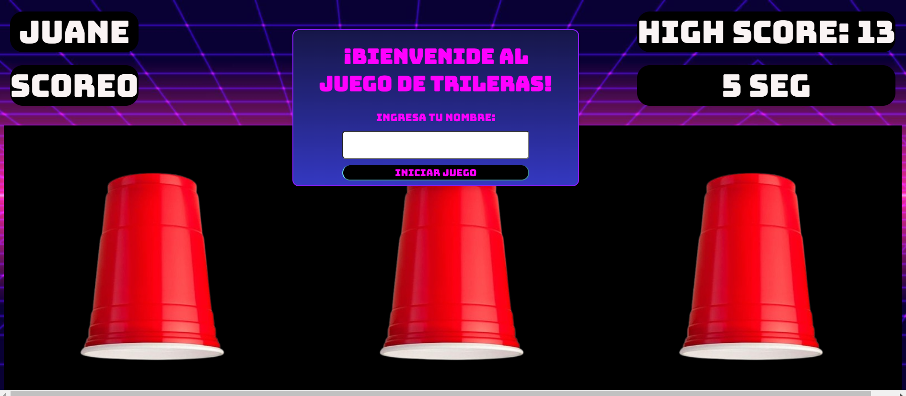

# 🌀 **Trileras Project** 🚀

Bienvenide al proyecto **Trileras**. Este juego está inspirado en la estética retro-futurista de los años 80, con colores neón brillantes, gráficos pixelados y sonidos sintéticos. Si eres fan de la música electrónica, los colores brillantes y las vibraciones de las décadas pasadas, ¡este es el juego adecuado para ti!

---

## 💻 **Instalación**

Para comenzar con el proyecto, sigue estos pasos:

1. **Clona el repositorio:**

   ```bash
   git clone https://github.com/einartech/carnival_dom_trileras.git
   cd carnival_dom_trileras


   Ejecutar index.html mediante la extensión de Live Server y ya podrás visualizar el proyecto ^^
   ```

   
